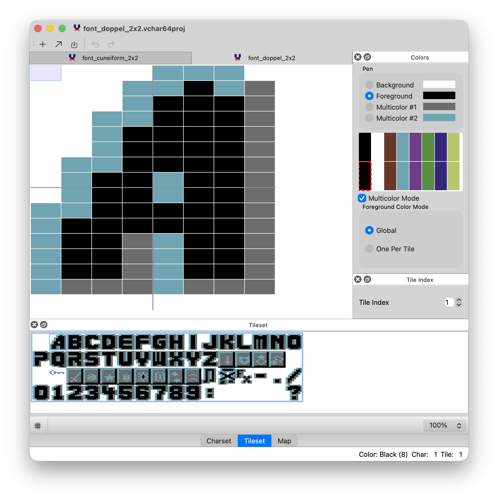

# VChar64

[](https://discord.gg/r5aMn6Cw5q)
[](https://github.com/ricardoq/vchar64/actions/workflows/ci.yml)
[](https://github.com/ricardoq/vchar64/releases)



## About

An editor for the Commodore 64/128

Tailored for my own needs, but feel free to send patches, to open bugs, etc.


## Features

* Char editing:
    * Cut, Copy & Paste
    * Clear
    * Invert
    * Flip Horizontally, Vertically
    * Rotate
    * Shift Up, Down, Left, Right
    * Undo, Redo
* Tile support:
    * From 1x1 to 8x8
    * Custom Distance in chars between tiles
* Map support
* Imports CharPad 1.8 and 2.0 projects
* Imports Koala image files: [Demo Video](https://www.youtube.com/watch?v=wIBTINBCngs)
* Imports VICE snapshot images
* Exports to Assembly, Raw and Prg
* Emulates different palettes: VICE, Pepto, Frodo, etc...
* Two Live Preview modes:
    * [TCP/IP server](https://github.com/ricardoquesada/vchar64/blob/master/server/README.md) support. [Demo Video](https://www.youtube.com/watch?v=yNCK_wZbo40)
    * [xlink](http://henning-bekel.de/xlink/) support. [Demo Video](https://www.youtube.com/watch?v=ZaSR_mxRfmo)
* Keyboard shortcuts for almost all actions

## Roadmap

In no particular order:

* Convert to PETSCII
* Tile: add Color Per Char (currently it supports Color Per Tile or Global)
* Tile: arbitrary composition of tiles
* Character / Tile animation support
* Sprite
   * Sprite editing
   * Sprite animation
* Level editor

## Requirements

* **Qt 6.8 or later** (Qt 5 is no longer supported as of version 1.0)
* CMake 3.16+
* C++17 compatible compiler

## How to compile it

### Install Qt

* Download [Qt Creator Community Edition 6.8](http://www.qt.io/download/) or newer (doesn't work with older versions)

### Command Line

```
$ git clone https://github.com/ricardoquesada/vchar64.git
$ cd vchar64
$ mkdir build
$ cd build
$ cmake ..
$ make
```

To update the translations do:

```
# To update the entries in the .ts file
$ cmake --build . --target update_translations

# To trigger the generation of the .qm files manually
$ cmake --build . --target release_translations
```

### Using Qt Creator

* Open `CMakeLists.txt` file with Qt Creator (qmake/`.pro` build is deprecated as of v1.0)
* Configure the project for "Desktop"
* Build & Run

## Supported platforms

* Linux (tested on Linux Arch)
* Mac (tested on v26.2)
* Windows (tested on Windows 10)

## Download binaries

* <https://github.com/ricardoquesada/vchar64/releases>

## License

* [Apache v2](http://www.apache.org/licenses/LICENSE-2.0)

